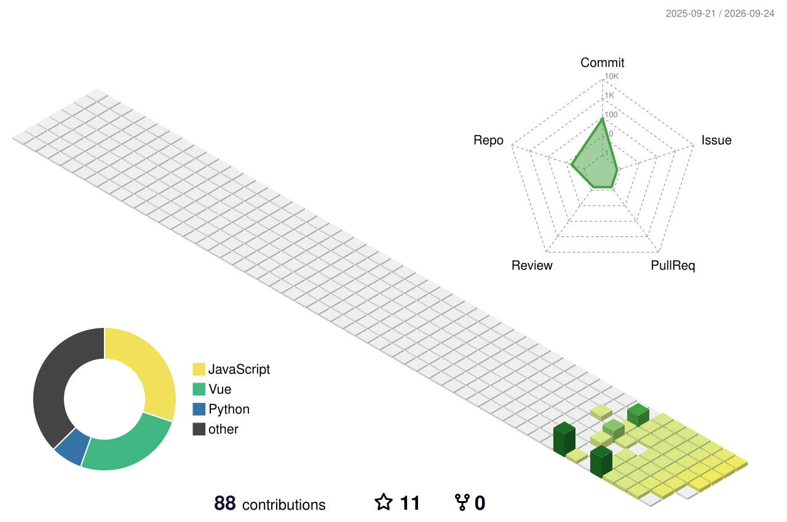

<!-- ========================= -->

<!-- Cover -->

<!-- ========================= -->

  

### Digital Portfolio

`Page 01` · `Portfolio` · `GitHub`

 

---

<!-- ========================= -->

<!-- About Me -->

<!-- ========================= -->

<table>
<tr>
<td width="50%" valign="top">

## 👋 About Me

Hi!! I'm **Mikawa**.

I'm interested in software development and enjoy learning new technologies and building things with code.

### 🌱 Currently Learning

* Programming
* Web Development
* Git & GitHub
* Open Source

### 💡 Interests

* 💻 Software Development
* 🎨 Creative Projects
* 🧩 Problem Solving
* 🚀 New Technologies

</td>

<td width="50%" valign="top">

## 🛠️ Tech & Tools

### Languages

  

### Tools

  

### Currently Exploring

  

</td>
</tr>
</table>

---

<!-- ========================= -->

<!-- Chapter 01 -->

<!-- ========================= -->

## 🛠️ Chapter 01 — My Tech Stack

*The tools I use to build things.*

 

  

  

 

`Programming` · `Web Development` · `Tools` · `Infrastructure`

---

<!-- ========================= -->

<!-- Chapter 02 -->

<!-- ========================= -->

## 📊 Chapter 02 — GitHub Activity

*The story of my activity on GitHub.*

 

---

<!-- ========================= -->

<!-- Chapter 03 -->

<!-- ========================= -->

## 🧊 Chapter 03 — Contribution Garden

*Every contribution leaves a mark.*

 

<picture>
  <source
    media="(prefers-color-scheme: dark)"
    srcset="profile-3d-contrib/profile-night-rainbow.svg"
  />
  <source
    media="(prefers-color-scheme: light)"
    srcset="profile-3d-contrib/profile-season-animate.svg"
  />
  
</picture>

---

<!-- ========================= -->

<!-- Chapter 04 & 05 -->

<!-- ========================= -->

<table>
<tr>

<td width="50%" valign="top">

## 📚 Chapter 04 — What I'm Building

### 🚧 Current Projects

> Coming soon...

### 💭 Future Ideas

* Personal projects
* Open-source contributions
* Creative coding experiments
* Useful tools and applications

</td>

<td width="50%" valign="top">

## 🏆 Chapter 05 — Achievements

### GitHub Journey

⭐ Building
📚 Learning
💻 Coding
🚀 Growing

 

*The journey is just beginning.*

</td>

</tr>
</table>

---

<!-- ========================= -->

<!-- Contact -->

<!-- ========================= -->

## 📫 Contact

Feel free to reach out!

 

---

<!-- ========================= -->

<!-- Final Page -->

<!-- ========================= -->

## Final Page

### Thanks for visiting!

*Every project is another page in the story.*

 

`Page 01` · `Page 02` · `Page 03` · `Page 04` · `Page 05` · `Final`

 

Built with Markdown · GitHub Actions · ❤️

